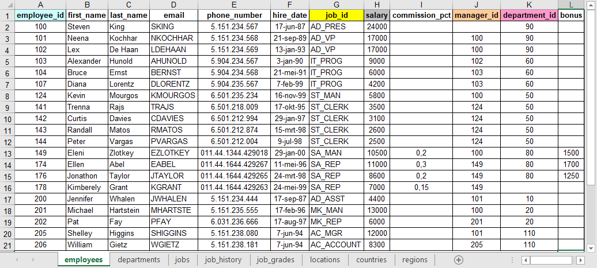
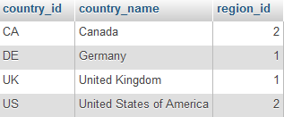
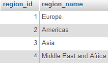
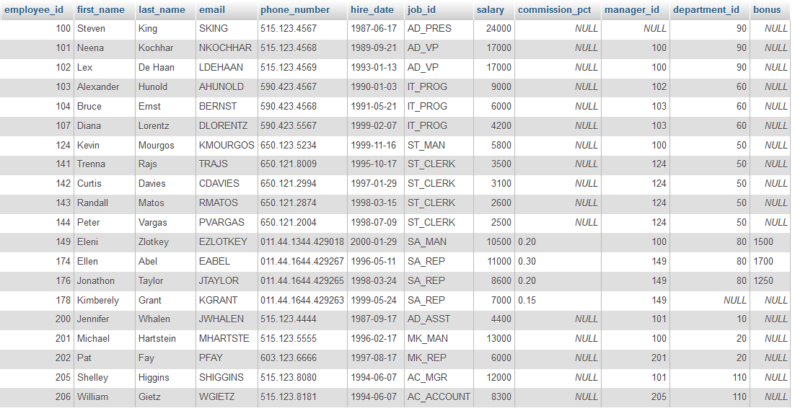

# RDBMS

Op YouTube staat een instructief filmpje met uitleg over DBMS en SQL.

<iframe width="560" height="315" src="https://www.youtube.com/embed/FR4QIeZaPeM" title="YouTube video player" frameborder="0" allow="accelerometer; autoplay; clipboard-write; encrypted-media; gyroscope; picture-in-picture; web-share" allowfullscreen></iframe>
 

Zoals je in het filmpje hebt kunnen zien, is het relationele model het meest gebruikte DBMS. Het centrale begrip in de relationele gegevensstructuur is de tabel of relatie (vandaar de naam van het model). Een tabel wordt beschouwd als een verzameling rijen of tupels. Alle gegevens van een relationele database liggen vast in de vorm van kolomwaarden binnen een rij van een tabel. De enige manier om in een relationele database gegevens met elkaar in verband te brengen bestaat uit de vergelijking van kolomwaarden. Er bestaan op zich geen ingebakken verbanden tussen tabellen onderling.

## Samengevat

1. Een database is een verzameling tabellen.
2. Een tabel is een verzameling rijen.
3. Een rij is een verzameling kolomwaarden.


Als je gewend bent te werken met Excel zul je de structuur herkennen. Een Excel werkblad kan verschillende tabbladen hebben met op elk tabblad een tabel. In elke tabel zie je rijen en kolommen met op de bovenste rij de kolomnamen. Hieronder zie je de tabel employees van Oracle in Excel. Je kunt de tabellen in Excel formaat hier downloaden. Ze staan dan bij elkaar op één werkblad. Het is handig een exemplaar op papier te hebben terwijl je met de cursus bezig bent.
 


Laten we maar eens een vraag stellen aan de database. Neem bijvoorbeeld de volgende query. We vragen alle informatie op van de tabel countries.

 
```SQL
SELECT *
FROM countries;
```

Dat levert onderstaand resultaat op. In deze tabel is `country_id` een *primary key*. Dat is een uniek veld en er moet een waarde zijn, elk land heeft een ander id van twee letters. Het veld `region_id` is in deze tabel een *foreign key*. Een foreign key is een veld dat verwijst naar een primary key in een andere tabel. Je herkent de primary keys en foreign keys in het Excel werkblad aan de kleuren van de namen van de kolommen. Als de kleur hetzelfde is, is er een verwijzing naar een andere tabel waar dezelfde kleur voorkomt.



Met onderstaande query vragen we alle informatie op van de tabel regions.

```SQL
SELECT *
FROM regions;
```
 

En dan zie je dat de region_id's een region_name hebben.


 

Nog een voorbeeld met de tabel employees.

 
```SQL
SELECT *
FROM employees;
```
 



 

Er zijn vier kolommen met `_id`, namelijk `employee_id`, `job_id`, `manager_id` en `department_id`. De *primary key* van de tabel `employees` is `employee_id` en de andere id's geven de relatie aan die er bestaat met deze tabel of met een andere tabel. De kolom `job_id` verwijst naar de tabel `jobs`, `manager_id` verwijst naar de tabel `employees` en de kolom `department_id` verwijst naar de tabel `departments`.

 

Als er employees toegevoegd worden, kunnen de namen van werknemers toevalligerwijs best hetzelfde zijn, er zijn immers mensen met exact dezelfde voor- en achternaam, maar er zijn nooit twee dezelfde employee_id's. Een primary key kan één kolom zijn of een combinatie van kolommen. In deze cursus is de primary key van de tabellen altijd maar één kolom en hij staat in deze database altijd in de eerste kolom. Vaak is een primary key numeriek en wordt hij automatisch opgehoogd (auto increment), maar het hoeft dus niet, want dat heb je bij de tabel countries gezien. Daar worden twee letters gebruikt.

 

Eigenschappen van tabellen in een relationele database:

1. Er staat maar één waarde in een kolom.
2. De waarden van een kolom zijn van hetzelfde soort.
3. Elke rij is uniek.
4. De volgorde van de kolommen doet er niet toe.
5. De volgorde van de rijen doet er niet toe.
6. Elke kolom heeft een unieke naam.


## Termen

* Een keyword verwijst naar een individueel SQL commando.
    * `SELECT` / `FROM` / etc.
* Een clause is een onderdeel van een SQL statement.
    * `SELECT last_name`
* Een statement is een combinatie van meerdere clauses.
    * `SELECT last_name FROM employees;`

## Goede gewoontes

* Een statement sluit je af met een puntkomma.
* Een query plaats je op verschillende regels, bijvoorbeeld:
    * Op de eerste regel SELECT.
    * Op de tweede regel FROM.
    * Op de derde regel WHERE.
    * Op de vierde regel ORDER BY.
* Gebruik geen spaties in kolomnamen. Als je meerdere woorden hebt voor de kolomnaam verbind je de woorden met een underscore (liggend streepje).

 