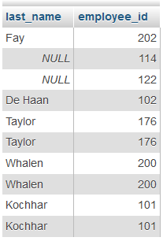
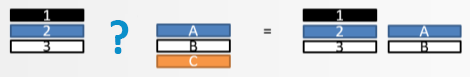
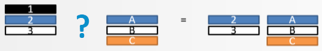

# Vragen bij sectie 6

:::{mchoice}
:correct: c

Vraag 1: Er zitten twintig werknemers in de tabel employees en er zijn twaalf rijen in de tabel jobs. Elke employee heeft een bepaalde job. Hoeveel rijen krijg je terug met de volgende query?
 
```SQL
SELECT last_name, job_title
FROM jobs CROSS JOIN employees;
```

* 12
* 20
* 240
    * Elke employee krijg elke job toegewezen, dus 20 x 12 = 240. Zie Cross join.
* De query geeft een foutmelding.

:::

:::{mchoice} Vraag 2
:correct: b 

Zal onderstaande query werken?

```SQL
SELECT e.last_name, j.job_title
FROM employees JOIN jobs ON e.job_id = j.job_id;
```

* ja
    * Nee. Op de tweede regel zijn de aliassen niet toegewezen. 
* nee
    * Inderdaad: op de tweede regel zijn de aliassen niet toegewezen. 
:::

:::{mchoice} Vraag 3
:correct: d

Wat hoort er te staan op de plaats van de puntjes?

```SQL 
SELECT first_name, last_name, department_id, department_name
FROM employees JOIN departments ...(department_id);
```
 
* NATURAL
* CROSS
* ON
* USING
:::

:::{mchoice}
:correct: b

Vraag 4: Wat hoort er te staan op de plaats van de puntjes?

```
SELECT last_name, job_title
FROM employees JOIN jobs ... employees.job_id = jobs.job_id;
```

* USING
* ON
* USING of ON (beide werken) 
:::

:::{mchoice} Vraag 5
:correct: b
 
Wat moet er staan op de plaats van de puntjes in onderstaande query?

```SQL 
SELECT e.last_name, j.employee_id
FROM employees e ... job_history j USING(employee_id);
```
 

 

* LEFT JOIN
* RIGHT JOIN
 
:::

:::{mchoice} Vraag 6
:correct: a
 
Het is mogelijk een tabel met zichzelf te joinen door twee aliassen te gebruiken voor dezelfde tabel. De database denkt dan dat er twee tabellen zijn. Hoe noem je zo'n JOIN?

* SELF JOIN
* INNER JOIN
* CROSS JOIN
* EQUI JOIN

:::

:::{mchoice} Vraag 7
:correct: a 

Welke join is er gebruikt in onderstaande afbeelding?



* left outer join
* right outer join
* full outer join

:::

:::{mchoice} Vraag 8
:correct: a 

LEFT OUTER JOIN en RIGHT OUTER JOIN zijn exact hetzelfde als LEFT JOIN en RIGHT JOIN. Het woordje OUTER kun je dus gewoon weglaten.

* ja
* nee

:::

 

:::{mchoice} Vraag 9
:correct: c

Wat is juist?

* De FULL OUTER JOIN is geen ANSI standaard maar je kunt hem wel gebruiken in MySQL.
* De FULL OUTER JOIN is ANSI standaard en kun je gewoon gebruiken in MySQL.
* De FULL OUTER JOIN is ANSI standaard maar kun je niet gebruiken in MySQL.
 
:::

:::{mchoice}
:correct: b
 
Welke join is er gebruikt in onderstaande afbeelding?



* left outer join
* right outer join
* full outer join

:::
